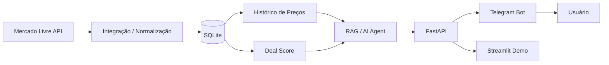

# DealMind AI — Running & Fitness Shopping Copilot

MVP de um copilot de compras focado em **corrida e fitness**, com integração
preparada para a API oficial do Mercado Livre, histórico de preços, alertas e
uma futura camada RAG para apoiar decisões de compra.

## Problema

Consumidores encontram muitas ofertas, mas têm dificuldade para responder:

- Esse preço realmente está bom?
- Qual opção oferece melhor custo-benefício?
- Vale comprar agora ou acompanhar?
- Qual produto faz mais sentido para minha necessidade?

O DealMind AI pretende transformar dados de marketplace em **decisão de compra**.

## Escopo do MVP

**Categoria:** corrida e fitness  
**Marketplace:** Mercado Livre  
**Canal planejado:** Telegram  
**Backend:** FastAPI  
**Persistência:** SQLite  
**Interface de demonstração:** Streamlit

## Arquitetura



## v0.2

- FastAPI
- Streamlit
- SQLite
- cliente isolado para Mercado Livre
- snapshots de preço
- endpoint de histórico
- Deal Score inicial
- pytest
- GitHub Actions
- modo demo sem credenciais

## Configuração

Copie `.env.example` para `.env` e preencha:

```text
MELI_ACCESS_TOKEN=seu_token
MELI_SITE_ID=MLB
```

Nunca envie `.env` para o GitHub.

## Instalação

```powershell
python -m venv .venv
.\.venv\Scripts\Activate.ps1
pip install -r requirements.txt
python run_api.py
```

Em outro terminal:

```powershell
.\.venv\Scripts\Activate.ps1
streamlit run frontend/streamlit_app.py
```

## Testes

```powershell
pytest -q
```

## Métricas de negócio

| Métrica | Resultado |
|---|---:|
| Ofertas capturadas | A medir |
| Produtos monitorados | A medir |
| Snapshots de preço | A medir |
| Alertas disparados | A medir |
| Economia potencial identificada | A medir |
| Taxa de alertas corretos | A medir |

## Roadmap

### v0.2 — Engenharia base
- [x] integração Mercado Livre desacoplada
- [x] histórico de preços
- [x] testes automatizados
- [x] GitHub Actions
- [x] arquitetura documentada

### v0.3 — Telegram
- [ ] bot oficial Telegram
- [ ] criação de alertas pelo chat
- [ ] worker de monitoramento
- [ ] disparo de alerta

### v0.4 — AI/RAG
- [ ] perguntas sobre histórico
- [ ] comparação de 3 produtos
- [ ] recomendação contextual
- [ ] explicação do Deal Score

### v1.0 — Deploy
- [ ] API pública
- [ ] bot funcional
- [ ] métricas reais
- [ ] demonstração no portfólio
