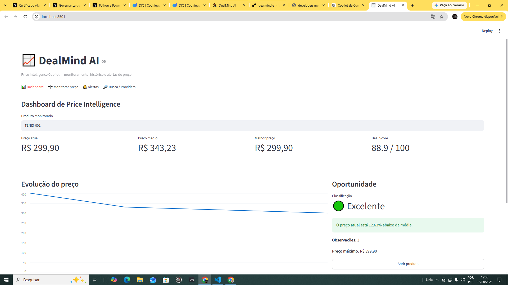
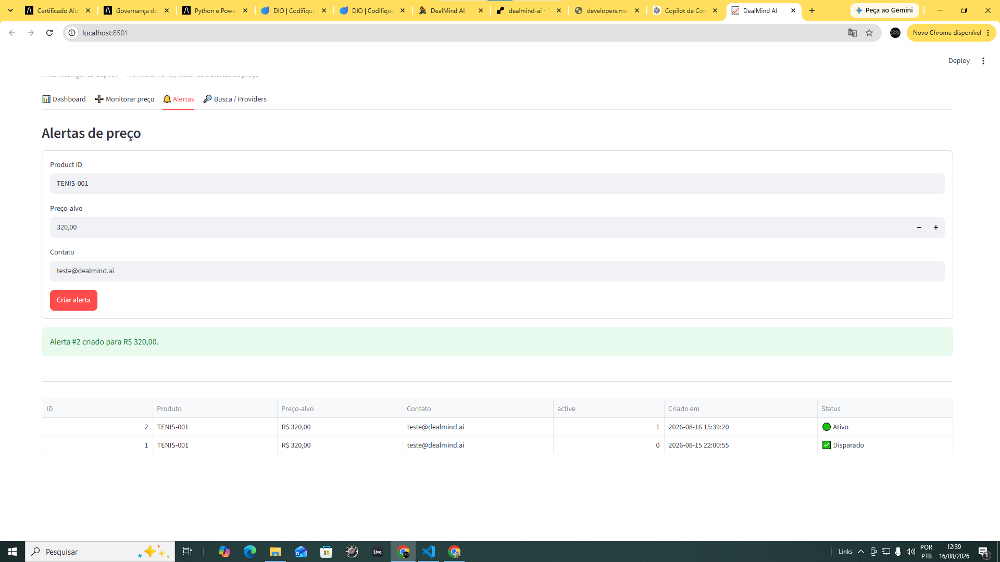
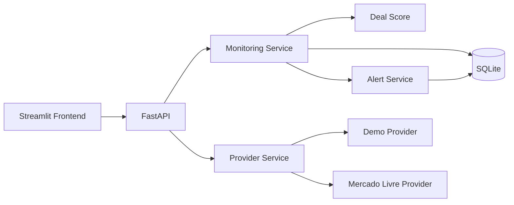
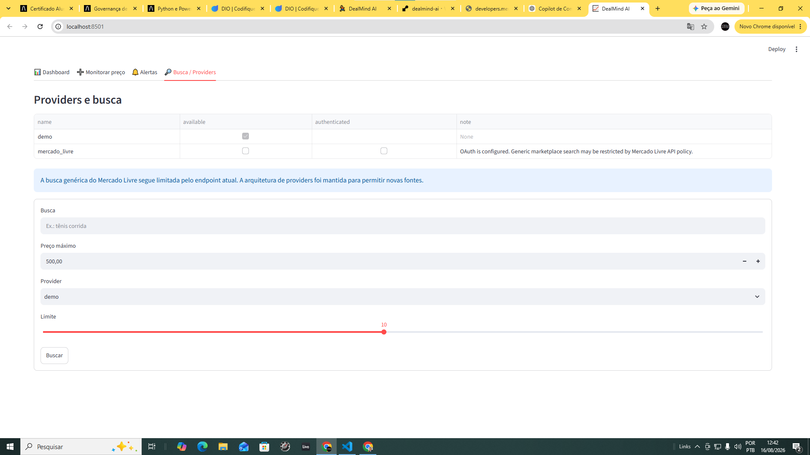

# 


*Price Intelligence Copilot Para Monitoramento, Análise e Alertas de Preços.*

O DealMind AI é um projeto de inteligência de preços desenvolvido para acompanhar produtos, registrar histórico de preços, avaliar oportunidades de compra e disparar alertas quando um preço-alvo é atingido.

O projeto foi estruturado como um MVP modular, com arquitetura preparada para múltiplos providers de marketplace e separação entre frontend, API, regras de negócio, persistência e integrações externas.

---

## Demonstração

### Frontend
https://dealmind-ai.streamlit.app

### API
https://dealmind-ai-9hme.onrender.com

### Swagger
https://dealmind-ai-9hme.onrender.com/docs

---

## 🎯 Problema

Consumidores frequentemente encontram dificuldade para responder perguntas simples durante uma compra :

- O preço atual está realmente bom?
- Esse produto já esteve mais barato?
- Quanto o preço atual está abaixo ou acima da média?
- Vale comprar agora ou esperar?
- Posso ser avisado quando atingir determinado preço?

O DealMind AI foi criado para transformar dados de preço em uma leitura mais objetiva da oportunidade de compra.

---

## 💡 Solução

O sistema permite :

- registrar observações de preço;
- construir histórico de preços;
- calcular preço médio, mínimo e máximo;
- comparar o preço atual com o histórico;
- calcular um **Deal Score**;
- classificar a oportunidade como:
  - Excellent;
  - Good;
  - Fair;
  - Weak;
- criar alertas de preço;
- detectar automaticamente quando o preço-alvo é atingido;
- visualizar os dados em um dashboard Streamlit;
- trabalhar com uma arquitetura desacoplada de providers.

---

## 📊 Dashboard de Price Intelligence

O dashboard apresenta os principais indicadores do produto monitorado :

- **Preço atual**
- **Preço médio**
- **Melhor preço**
- **Deal Score**
- **Histórico de preços**
- **Variação em relação à média**
- **Classificação da oportunidade**
- **Quantidade de observações**
- **Status dos alertas**

Exemplo de cenário utilizado na demonstração :

| Indicador | Valor |
|---|---:|
| Preço inicial | R$ 399,90 |
| Segunda observação | R$ 329,90 |
| Preço atual | R$ 299,90 |
| Preço médio | R$ 343,23 |
| Variação vs. média | -12,63% |
| Deal Score | 88,9 / 100 |
| Classificação | Excellent |

### Visão do Dashboard

O dashboard consolida os principais indicadores de Price Intelligence do produto monitorado, incluindo preço atual, média histórica, melhor preço, Deal Score, evolução do preço e classificação da oportunidade.



---

## 🧠 Deal Score

O Deal Score é uma métrica criada no projeto para representar a atratividade do preço atual em relação ao histórico observado.

O cálculo considera principalmente :

- preço atual;
- preço médio;
- menor preço registrado;
- distância do preço atual em relação à média histórica.

Quanto melhor a oportunidade, maior o score.

Exemplo:

```text
Deal Score: 88.9 / 100
Classificação: Excellent
Preço atual: 12,63% abaixo da média
```

## 🔔 Alertas de Preço

O usuário pode definir um preço-alvo para um produto.

Exemplo:

```text
Produto: TENIS-001
Preço-alvo: R$ 320,00
Preço atual: R$ 299,90
R$ 299,90 <= R$ 320,00
Disparado
```

### Gestão de alertas

A interface permite configurar preços-alvo para produtos monitorados e acompanhar o status dos alertas. Quando uma nova observação atinge o valor definido, o sistema identifica automaticamente a condição e registra o alerta como disparado.



---

## 🏗️ Arquitetura

O DealMind AI utiliza uma arquitetura modular, separando interface, API, regras de negócio, persistência e providers externos.



Essa estrutura permite que o núcleo de Price Intelligence continue funcionando independentemente da fonte utilizada para obtenção dos dados de produtos e preços.

---

## 📁 Estrutura do Projeto

A organização do repositório segue uma separação entre API, serviços, providers, persistência, frontend e testes.

```text
dealmind-ai
│
├── app
│   ├── api
│   │   ├── main.py
│   │   └── monitoring_routes.py
│   │
│   ├── database
│   │   └── db.py
│   │
│   ├── integrations
│   │   └── mercado_livre.py
│   │
│   ├── models
│   │
│   ├── providers
│   │   ├── base.py
│   │   ├── demo_provider.py
│   │   └── mercado_livre_provider.py
│   │
│   ├── repositories
│   │   ├── alert_repository.py
│   │   └── offer_repository.py
│   │
│   └── services
│       ├── monitoring_service.py
│       ├── provider_service.py
│       └── token_store.py
│
├── frontend
│   └── streamlit_app.py
│
├── tests
│
├── data
│
└── requirements.txt
```

---

## 🛠️ Tecnologias

O DealMind AI combina tecnologias de backend, análise de dados, frontend e cloud.

### Backend e Dados

- Python
- FastAPI
- Pydantic
- SQLite
- Pandas
- Requests

### Frontend

- Streamlit

### Integrações

- REST APIs
- OAuth 2.0
- Arquitetura de Providers

### Qualidade e Desenvolvimento

- Pytest
- Git
- GitHub

### Deploy

- Render
- Streamlit Community Cloud

---

## 🔌 API e Principais Endpoints

O backend do DealMind AI foi desenvolvido com FastAPI e disponibiliza documentação interativa por meio do Swagger.

### Health Check

```http
GET /health
```

Verifica se a API está operacional.

### Providers

```http
GET /providers
```

Lista os providers disponíveis e seus respectivos status.

### Busca de Produtos

```http
GET /products/search
```

Realiza a busca utilizando a camada de providers.

### Registrar Observação de Preço

```http
POST /monitoring/snapshots
```

Registra um novo snapshot de preço e atualiza a análise do produto.

### Consultar Análise do Produto

```http
GET /monitoring/{product_id}
```

Retorna indicadores como preço atual, preço médio, mínimo, máximo, variação, Deal Score e classificação da oportunidade.

### Consultar Histórico de Preços

```http
GET /monitoring/{product_id}/history
```

Retorna as observações de preço armazenadas para o produto.

### Criar Alerta

```http
POST /alerts
```

Cria um alerta associado a um produto e a um preço-alvo.

### Listar Alertas

```http
GET /alerts
```

Lista os alertas cadastrados e seus respectivos status.

---

## 🛒 Providers e Integração com Marketplaces

O DealMind AI utiliza uma camada de **providers**, permitindo que diferentes fontes de produtos e preços sejam integradas sem alterar o núcleo de Price Intelligence.

Essa arquitetura reduz o acoplamento entre as regras de negócio e APIs externas específicas.

### Demo Provider

O `DemoProvider` funciona como fonte controlada para desenvolvimento, testes e demonstração do fluxo completo da aplicação.

**Status:** disponível.

Ele permite validar :

- busca de produtos;
- integração frontend/backend;
- arquitetura de providers;
- monitoramento;
- histórico de preços;
- Deal Score;
- alertas.

### Mercado Livre Provider

A integração com o Mercado Livre contempla :

- OAuth 2.0;
- fluxo de autorização;
- access token;
- refresh token;
- callback OAuth;
- cliente de integração;
- provider específico;
- tratamento de erros da API externa.

Durante o desenvolvimento, a autenticação OAuth foi validada com sucesso. Entretanto, o endpoint genérico de busca utilizado pela aplicação :

```text
/sites/MLB/search
```

passou a retornar :

```text
403 Forbidden
```

Por esse motivo, o Mercado Livre permanece implementado como provider, mas a disponibilidade da busca depende das políticas e permissões da API externa.

O núcleo do DealMind AI foi mantido **independente dessa integração**, permitindo que o sistema de monitoramento, histórico, Deal Score e alertas continue funcionando e que novos providers sejam adicionados futuramente.

### Providers disponíveis

A arquitetura de providers desacopla o núcleo de Price Intelligence das fontes externas de dados. O `DemoProvider` permite demonstrar e testar o fluxo completo da aplicação, enquanto a integração com o Mercado Livre permanece preparada para evolução conforme as políticas e endpoints disponibilizados pela plataforma.



---

## 💾 Persistência e Histórico de Preços

O MVP utiliza **SQLite** para persistir os dados necessários ao monitoramento e aos alertas.

A camada de persistência foi separada das regras de negócio por meio de repositories, facilitando uma futura migração para outro banco de dados.

### Histórico de preços

A tabela `offer_history` armazena os snapshots capturados ao longo do tempo.

Entre os principais dados registrados estão :

- identificador do produto;
- nome do produto;
- preço atual;
- preço original;
- URL;
- categoria;
- data e hora da captura.

A partir desse histórico, o DealMind AI consegue calcular :

- preço atual;
- preço médio;
- menor preço observado;
- maior preço observado;
- variação do preço atual em relação à média;
- número de observações;
- Deal Score;
- classificação da oportunidade.

### Alertas

A tabela `price_alerts` mantém os alertas configurados pelo usuário.

Cada alerta pode armazenar :

- produto monitorado;
- preço-alvo;
- contato;
- status do alerta;
- data de criação.

Quando uma nova observação de preço é registrada, o sistema verifica os alertas ativos associados ao produto.

Se o preço atual for menor ou igual ao preço-alvo, o alerta é identificado como atingido e passa para o status de **disparado**.

---

## 🧪 Testes Automatizados

O DealMind AI possui testes automatizados desenvolvidos com **Pytest**, utilizados para validar componentes importantes da aplicação e reduzir o risco de regressões durante a evolução do projeto.

Os testes cobrem funcionalidades relacionadas a :

- integração com marketplace;
- camada de providers;
- monitoramento de preços;
- cálculo do Deal Score;
- regras de análise de oportunidades.

Para executar a suíte de testes localmente :

```bash
python -m pytest -q
```

Durante o desenvolvimento do MVP, a suíte atual foi validada com sucesso:

```text
9 passed
```

A utilização de testes automatizados permite evoluir novas integrações e funcionalidades mantendo maior segurança sobre os componentes já implementados.

---

## 🚀 Como Executar Localmente

### 1. Clonar o repositório

```bash
git clone https://github.com/MCLG1661/dealmind-ai.git
cd dealmind-ai
```

### 2. Criar o ambiente virtual

```bash
python -m venv .venv
```

### 3. Ativar o ambiente virtual

No Windows PowerShell:

```powershell
.\.venv\Scripts\Activate.ps1
```

### 4. Instalar as dependências

```bash
pip install -r requirements.txt
```

### 5. Executar a API

```bash
uvicorn app.api.main:app --reload --port 8000
```

A documentação interativa da API ficará disponível em :

```text
http://127.0.0.1:8000/docs
```

### 6. Executar o frontend

Em outro terminal, com o ambiente virtual ativado :

```bash
streamlit run frontend/streamlit_app.py
```

O Streamlit informará no terminal o endereço local utilizado pela aplicação.

### 7. Configuração da API utilizada pelo frontend

Por padrão, o frontend utiliza :

```text
http://127.0.0.1:8000
```

Também é possível definir a variável de ambiente:

```text
DEALMIND_API_URL
```

para apontar o frontend para outra instância da API.

---

## 🌐 Deploy e Demonstração Pública

O DealMind AI possui backend e frontend publicados em ambientes separados, seguindo uma arquitetura simples de aplicação web.

### Frontend

O frontend foi publicado no **Streamlit Community Cloud** :

```text
https://dealmind-ai.streamlit.app
```

A interface pública permite visualizar :

- Dashboard de Price Intelligence;
- histórico de preços;
- Deal Score;
- classificação da oportunidade;
- formulário de monitoramento;
- alertas;
- status dos providers.

### Backend

A API FastAPI está publicada no **Render** :

```text
https://dealmind-ai-9hme.onrender.com
```

### Swagger

A documentação interativa da API está disponível em :

```text
https://dealmind-ai-9hme.onrender.com/docs
```

### Integração Frontend/Backend

No ambiente público, o frontend Streamlit utiliza a variável :

```text
DEALMIND_API_URL
```

apontando para a API hospedada no Render.

O fluxo de produção fica:

```text
Streamlit Community Cloud
        ↓
FastAPI / Render
        ↓
Monitoring Service
        ↓
SQLite + Deal Score + Alerts
```

---

## ✅ Status do MVP


### Implementado

- [x] API REST com FastAPI
- [x] Frontend com Streamlit
- [x] Persistência com SQLite
- [x] Arquitetura modular de providers
- [x] Demo Provider
- [x] Integração OAuth 2.0 com Mercado Livre
- [x] Monitoramento de produtos
- [x] Registro de snapshots de preços
- [x] Histórico de preços
- [x] Cálculo de preço médio, mínimo e máximo
- [x] Variação do preço em relação à média
- [x] Deal Score
- [x] Classificação de oportunidades
- [x] Criação de alertas de preço
- [x] Detecção automática do preço-alvo
- [x] Status de alerta disparado
- [x] Dashboard de Price Intelligence
- [x] Testes automatizados
- [x] API pública no Render
- [x] Frontend público no Streamlit Community Cloud
- [x] Documentação interativa com Swagger

### Em evolução

- [ ] coleta automática e periódica de preços
- [ ] integração com novos providers
- [ ] notificações via Telegram
- [ ] persistência de produção em banco gerenciado
- [ ] camada de IA generativa / RAG
- [ ] recomendação contextual de compra

---

## 🗺️ Roadmap

O desenvolvimento do DealMind AI está organizado em etapas incrementais, preservando a arquitetura modular construída no MVP.

### v0.4 — Automação e notificações

- [ ] worker para monitoramento periódico de preços
- [ ] atualização automática do histórico
- [ ] integração com Telegram
- [ ] envio automático de alertas
- [ ] tratamento de falhas e novas tentativas de coleta

### v0.5 — Inteligência Artificial e RAG

- [ ] perguntas em linguagem natural sobre o histórico de preços
- [ ] explicação do Deal Score em linguagem natural
- [ ] comparação contextual entre produtos
- [ ] recomendação de compra baseada em histórico e preço
- [ ] geração de insights sobre oportunidades

### v0.6 — Dados e novos providers

- [ ] integração com novas fontes de produtos e preços
- [ ] banco de dados persistente e gerenciado em produção
- [ ] séries históricas maiores
- [ ] monitoramento simultâneo de múltiplos produtos
- [ ] métricas de performance dos providers

### v1.0 — Evolução para produto

- [ ] monitoramento automatizado ponta a ponta
- [ ] múltiplos marketplaces
- [ ] múltiplos canais de notificação
- [ ] autenticação de usuários
- [ ] observabilidade e métricas
- [ ] camada de IA generativa integrada à experiência do usuário

---

## 🎓 Objetivo de Portfólio

O DealMind AI foi desenvolvido como um projeto de portfólio com foco na aplicação prática de **dados, inteligência artificial, engenharia de software e visão de negócio** em um problema real do e-commerce.

Mais do que construir uma interface de busca, o projeto busca demonstrar como dados históricos de preços podem ser transformados em informações úteis para apoiar decisões de compra.

O desenvolvimento do MVP demonstra competências em :

- Data Science aplicada a problemas de negócio;
- desenvolvimento backend com FastAPI;
- construção de interfaces analíticas com Streamlit;
- integração com APIs externas;
- OAuth 2.0;
- arquitetura modular de software;
- persistência e histórico de dados;
- criação de métricas e regras de negócio;
- desenvolvimento de um Deal Score;
- automação baseada em eventos;
- testes automatizados;
- Git e GitHub;
- deploy de aplicações em cloud;
- desenho e evolução de produtos orientados por dados.

O projeto também foi estruturado para evoluir gradualmente para recursos de **IA generativa, RAG, recomendação contextual e automação**, sem tornar essas tecnologias dependências artificiais do MVP.

---

## 👤 Autor

**Marcus Corrêa Lopes Guedes**

Profissional com experiência em **Marketing, Operações, Gestão e Projetos**, atualmente aprofundando sua atuação em **Data Science, Inteligência Artificial e soluções orientadas por dados**.

### Contato e portfólio

- **GitHub:** https://github.com/MCLG1661
- **LinkedIn:** https://www.linkedin.com/in/marcusguedes/

---

### DealMind AI

**Transformando histórico de preços em inteligência para decisões de compra.**
